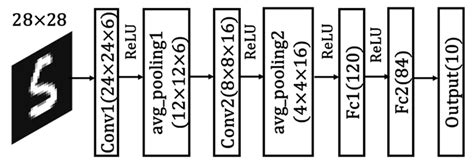

# Handwritten-Chinese-Identifier
iOS app that uses a convolutional neural network to identify pictures of handwritten Chinese characters 

### Pretraining
A base model using Lenet-5 architecture was created with keras subclassing and pretrained on MNIST dataset. The architecture consists of inputs 28x28 fed into a 5x5x6 conv layer --> average pooling layer --> 5x5x16 conv layer --> average pooling layer --> flatten --> fc 120 --> fc 84 --> softmax 10 classes

### Transfer Learning & Fine Tuning
Then, transfer learning was used to fine tune the model on a custom image dataset collected of handwritten Chinese characters. Fine tuning involved freezing the convolutional layers and retraining only the last few fully connected layers on the custom dataset. This is done because convolutional layers trained on the MNIST handwritten digits may also share some features with a custom handwritten dataset, while the last few FC layers are more specialized and need to be adapted to the new dataset through fine tuning. 

### Model Evaluation and Improvement 
After fine tuning the model achieve a training accuracy of 99.31% and testing accuracy of 82.11%, indicating that overfitting has occured. This is probably due to the dataset size being so small, some ways to prevent overfitting include adding more data (increasing the dataset size or data augmentation), regularization, or neural network architecture search. A manual error analysis of the test dataset may reveal which examples or classes are responsible for most of the error and therefore a strategy to balance out the data if we decide to increase the dataset size... 

### Convert Tensorflow model to CoreML

The model was then converted to a CoreML model using the coremltools library. The coremltools library allows specification of an image input type. When exported into Xcode, the model takes an input of a grayscale 28x28 image and outputs a String of predicted class label. 

### iOS app using SwiftUI, CoreML, and Vision frameworks 

The iOS app layout was built using the SwiftUI framework. Upon a button click, users can choose to take a photo from the camera or upload an image from photo library within the app. Previously, images fed into a CoreML model need to be resized, grayscaled, and converted to a CVPixelBuffer. This is complicated and can slow down the model. Instead the new Vision framework can do all the preprocessing for us. The Vision framework was then used to take the input image and preprocess it to fit the input specifications that the CoreML model expects, as well as take the ouput of the model and format it to a String to be displayed on the screen. 

